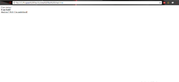
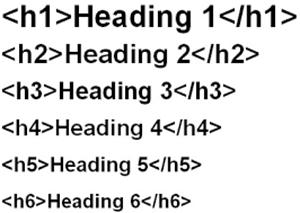
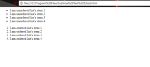

   A step-by-step walk through of your first HTML page 

  
[blog.codingninjas.in](http://blog.codingninjas.in)

Coding Ninjas Official Blog

A step-by-step walk through of your first HTML page
===================================================

  

**Devansh**

**Kasaudhan**

HTML is short for HyperText Markup Language.Basically, it’s the “code” behind every webpage – even this one. If you’re just beginning to learn HTML, let us tell you that it’s a fairly easy task. HTML, without styling, can’t do anything more than setting a layout, drawing a table, or creating frames – but it is handy as it helps you structure the content correctly, which is important when you sit down to add style to your HTML.

However simple this might seem, it is a mighty useful tool when it comes to full-fledged web development. Various tools easily eliminate the HTML coding from your work process – but if you want to be in full control of your web-page, you’ll need to have some command over HTML.

Through this article, we aim to give you the essential HTML building blocks that’ll help you get up and running. Reading this, you’ll be able to understand an HTML source code and even modify it for your own good!

### Step One - TAGS

Tags are what you'll see the most when you look at any HTML source code. A tag can ideally be seen as a wrapper to any item on your HTML document. Tags tell what magic is to be done on the content enclosed by them.

Let's look at two types of tags:

1.  < tag-example-1 > I need a closing tag < tag-example-1 > < /tag-example-1 >
2.  < tag-example-2/ > I don't need a closing tag.

In the first example, the sentence is wrapped by two tags. The first one is called the opening tag and the second one is called the closing tag. Everything in between is affected by the properties of the tag. Very commonly used examples of such tags are < html > , < head > , < body >, < strong > , etc.

The second example tags about loner tags as in, they don't need a closing tag to function. Although it's not required, these type of tags are often written as < tag/ > to make the debugging of code easier. Common examples of such tags are < hr/ > “ used for horizontal line, < br/ > to break the line, etc.

### Step Two - HTML, HEAD, and BODY: The three pillars of your document

These tags are essential for any HTML document. They parcel out the significant parts of your HTML code.

*   < BODY > < /BODY > is placed below your < HEAD > tag, and everything that you want to be displayed on your screen comes under this tag. Text, images, links, and pretty much anything you can see in your browser live inside this tag.
*   < HTML > < /HTML > wraps your entire code. Everything else in your HTML document needs to come inside these tags.
*   < HEAD > < /HEAD > includes things like title, styles, and scripts. Head is usually present at the top (hah!), just inside the < /HTML > tag.

### Step three - A few tags that'll make your page pretty

Now that you know how to set up the skeleton of your document, let's proceed with the things that will go inside your < BODY > tag and do some magic!

Some basic text formatting tags:

*   < b > </b > makes your text look bold
*   < i > </i > makes you write in cursive
*   < u > </u > underlines what you just wrote

For example, this piece of code

* * *

`< html >`  
  
  `< head > < /head >`  
  
  `< body >`  
  
    `< i > I am italics! < /i > < br/ >          < b > I am bold! < /b > < br/ >          < u > And me, well, I'm underlined! < /u > < br/ >`  `< /body >`  
  
`< /html >`

* * *

Should produce something like this on your browser: Don't fret too much about the <br/ >. It's just for breaking the line so that you can start from the next line. Enter key does little when it comes to changing lines in your HTML document.

#### Tags to help you structure your content:

*   < br/ > breaks the line, making you continue to the next line
*   < p > stands for paragraph. It divides your content into paragraphs

_Note: You need to use these tags as space and enter keys do very little when it comes to formatting content inside an HTML document._

#### Heading Tags:

HTML provides you with six tags, from <H1> </H1> to <H6> </H6> to help you create different sized headers quickly.

#### Inserting an Image:

All that's good, but what fun without images on the webpage? Don't worry,  to the rescue! The image tag has a mandatory attribute called “source”. Basically, it tells the browser where it should look for the image. The syntax goes something like:

_< img src = "path\_to\_your\_image" />_

Furthermore, it also has attributes like height and width that let you specify the height and width you want your image to take.

#### Lists:

HTML has two types of lists – ordered and unordered. Each item of your list has to be enclosed in a tag. The syntax for creating a list is fairly simple.

Suppose you want to create a list like:

*   item 1
*   item 2
*   item 3

The following code will easily do the job for you:

* * *

`<ul >`  
  
  `< li > item 1 </li >`  
  
  `< li > item 2 </li >`  
  
  `< li > item 3 </li >`  
  
`</ul >`

* * *

This, by the way, was an example of an unordered list. For an ordered list, all you need to do is replace <ul > with < ol > and </ul > with < /ol >.

Let's see what the following code does:

* * *

`< html >`  
  
  `< head > < /head >`  
  
  `< body >`  
  
    `< ul >          < li >I am unordered list's item 1! < /li >          < li >I am unordered list's item 2! < /li >          < li >I am unordered list's item 3! < /li >          < li >I am unordered list's item 4! < /li >          < /ul >`  
    `< ol >          < li >I am ordered list's item 1! < /li >          < li >I am ordered list's item 2! < /li >          < li >I am ordered list's item 3! < /li >          < li >I am ordered list's item 4! < /li >          < /ol >`  
  
  `< /body >`  
  
`< /html >`

* * *

All of these tags, when arranged coherently, will provide you with a simple webpage consisting of images, headings, and lists. Further, there are various tags that HTML supports, and we thoroughly recommend you to check them out and play with them!

### In Conclusion

You now know enough to skim through and understand any part of an HTML code. We request you to go ahead and try skimming through the source code of any website (you’ll find some tags you don’t know, but that’s how you learn!). Oh, and welcome to the world of web development. With HTML under your belt, your next stop should be making your page look beautiful using CSS.

Let us know if you had any problems in the article, and don’t forget to have a look at a source code or two!

### SUBSCRIBE NOW TO STAY UPDATED WITH NEW TECHNOLOGY TRENDS

Comment\*  

COMMENT

Name  

Email\*  

SUBSCRIBE

  

### SEARCH

 

  

### RECENT POST

*   [A step-by-step walk through of your first HTML page](HTML\coadingninja\assingnment_html  first HTML page.html)
*   [Best Coding Practices for Hassle-free Programming](HTML\coadingninja\Hassle-free Programming add_sementic_tag.html)
*   [Five tips for front end web development](HTML\coadingninja\coadingblog Five tips.html)

  

### CATEGORIES

*   Android
*   General
*   Ruby
*   Python
*   Web development
*   Maachine learning

     